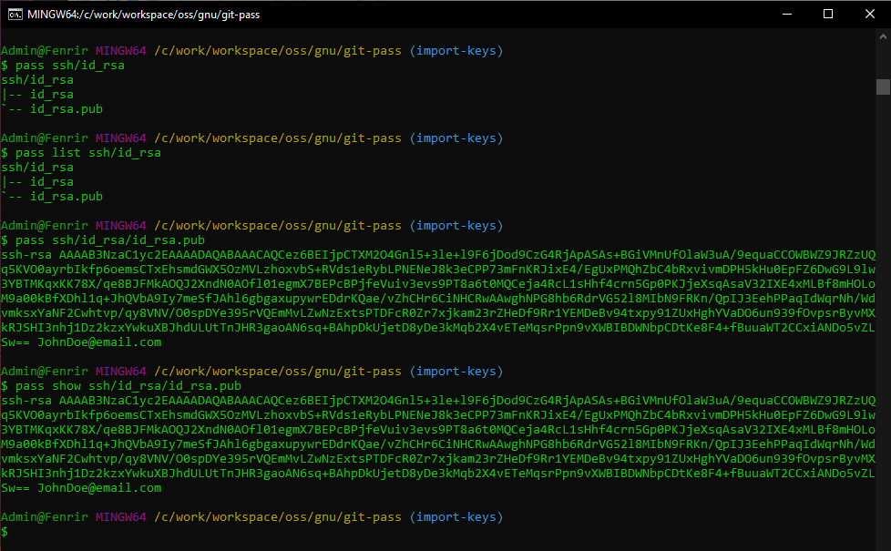
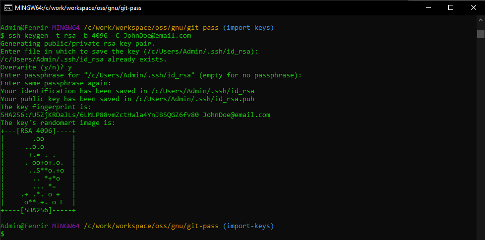
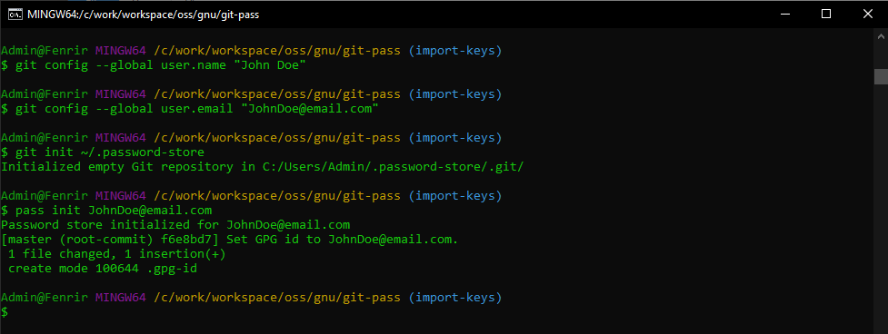
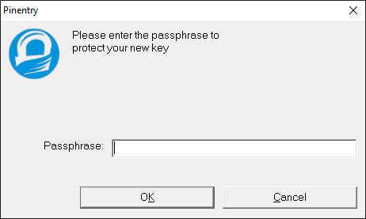

# Git-Pass 

  *Minimal Windows POSIX pass command*

Git-Pass is a port of the POSIX pass command (aka password-store) for GitBash and Powershell.

It is meant for institutional thin-client windows PCs that only allow a minimal GitBash shell.

# Motivation

Many corporate and institutional environments use minimal thin client PCs

and typically restrict downloads and the gamut of installable software,

often to the frustration of Cloud Operators, Integrators, and Developers.

.

Now cloudops and devops need to secure their machines and drive automation.

For Convenience and for compliance to encrypt data at rest and in transit,

it would be best to install a minimal low-footprint secure secret manager.

.

GitPass is for those cases, where a full Cygwin POSIX is not sanctioned,

Where only gitbash is allowed, where there is no PacMan package manager,

and where we definitely do not have GNU autotools or a GLIBC toolchain.

.

Though password-store is a 100% bash .sh script, it installs via a Makefile.

Gnu Make will not be present on corporate environments without a toolchain,

and the platform.sh script is broken for gitbash (it only expected cygwin).

I've patched it to work on gitbash (it should work on MSys and the others).

.

I've also ported the pass script to powershell and exposed its interface

as a Microsoft windows object (a PowerShell.SecretManagement ISecureVault).

We can use it everywhere: on unix, linux, windows powershell and gitbash !

.

Portability, Simplicity, Security.

#  Abstract

Git-Pass is a port of the POSIX pass command (aka password-store),

for institutional desktops that only allow a limited Gitbash shell.

.

Pass is a secure Secrets Store aka a Secure Password-Manager or Vault.

It follows the POSIX design of using simple composable shell commands.

It is meant for portability and simplicity -it is mostly shell-diven;

all it needs is a shell with installed SSH, SSL, GPG, Git, and Tree.

.

Our architecture design seeks simplicity, portability, and consistency.

Pass gives us a consistent secret manager accross windows, linux, & unix,

even on corporate or institutional minimal thin-client windows desktops.

Git-Pass includes our own `pass.ps1` script porting pass to powershell.

.

There are many secret stores, from Keepass to SOPS and Hashicorp Vault.

Many are UI based and may use licensed binaries or cloud subscriptions.

Many are proprietary and store their database as a single opaque vault.

.

Pass is different. By design it is open and transparent in its workings.

.

Pass is free, lightweight, portable, with well audited open-source code.

It is but a script that calls industry-standard OSS tools: SSL, GPG, Git.

The encryption uses state of the art crypto via RSA keys and GNUPG keys.

.

The vault is just a directory tree, into which go our encrypted secrets.

Thus secret names can be easily located, indexed, globbed, and queried.

This open directory structure makes it extremely adaptable and flexible.

.

The directory can also be a Git repo and can be shared over machines.

It can also be shared with other users or multiple vaults can be used.

.

The secret file format holds a plain text secret on its very first line;

the rest of the file may contain metadata as name-value parameter pairs.

.

You can use it for passwords, secrets, identity credentials, SSH PEM keys.

They can be invoked or piped in a command-line or pasted to the clipboard.

Pass has a plethora of extension plugins to integrate with other systems.

.

The only extension we require is pass-file to encrypt entire files.

We use this to encrypt SSH private keys and Certificate private keys.

Now we could just secure keys with a passphrase - pass simplifies this

by providing a single API interface to unify all our private secrets

in a single vault with a single passphrase.

.

Now because it is but a script that calls other minimal POSIX commands,

we can adapt it and have a common interface for both Bash and Powershell.

For added portability, we can implement the PowerShel.SecretManagement

ISecureVault API and integrate with the windows application ecosystem.

.

# Workflow

We need to distinguish between Identity Secrets and derived Access Secrets,

to isolate the Initial Trust authentication from subsequent authorisations. 

.

On the thin desktop client, we use git-pass to secure the Initial Trust,

to establish Identity Secrets, things like OTP logins, SSH keys, PGP keys.

That's where git-pass comes in, to establish a secure connection or session.

It is also useful for local desktop apps, for web proxy and web site access.

.

We could try to add extension plugins and make it talk to everything.

We shall try not to reinvent the wheel and use industry-standard tools.

.

We will need to manage scope and temporary Landing Zone access credentials,

to narrow a vendor cloud context to a specific root tenant and org account,

or narrow a cloud managed kubernetes context to a desire kubernetes cluster.

.

The ideal strong security for secrets will use SOPS (Secrets-Operations).

Mozilla SOPS is a neutral Cloud-Native-Foundation tool to secure IaC code,

integrating with GPG, Hashicorp Vault, GCP KMS, AWS KMS, Azure AKV, etc.

But that's on the CI/CD/CT factory and the server, and for Data Secrets.

.

We will address SOPS and cloud context scopes in a later project.

#  Documentation

For the TLDR keep on reading this doc and following instructions.

Browse the official password-store docs For further documentation.

[Original Manual](https://git.zx2c4.com/password-store/about/)

[Original project](https://www.passwordstore.org/)

#  Preparation

Have an email identity to be used with the following:

    - Git account
    - SSH keypair
    - GPG keyring

Example:

    name:  John Doe
    email: JohnDoe@email.com
   

#  Installation

In an admin gitbash shell, clone this repo and run the install script.
    
    ./install.sh

# Configuration

### Memorable Passphrase

Pick a [Memorable Passphrase](https://strongphrase.net/)

### SSH Keypair

If necessary, generate an SSH keypair:

    ssh-keygen -t rsa -b 4096 -C JohnDoe@email.com

### GPG KeyRing

If necessary, Generate your GPG keyring:

    gpg --full-generate-key

Use following parameters:

    key kind:      1 (RSA)
    key size:      4096
    validity:      0 (never expires)

Sample output:

    Real name: John Doe
    Email address: JohnDoe@email.com
    You selected this USER-ID:
      "John Doe <JohnDoe@email.com>"

### Password-Store Git repo

If necessary, configure your Git user

    git config --global user.name "John Doe"
    git config --global user.name "JohnDoe@email.com"    

Create the `.password-store dir` as a Git repo:

    git init ~/.password-store

    Initialized empty Git repository in C:/Users/JohnDoe/.password-store/.git/

### Password-Store pass database

Initialize the  `.password-store` Pass database.

    pass init .password-store JohnDoe@email.com

    Password store initialized for .password-store, for identity: JohnDoe@Email.com.
    [master (root-commit) e6bcfa6] Set GPG id to .password-store, JohnDoe@Email.com.
     1 file changed, 2 insertions(+)
     create mode 100644 .gpg-id
 

### GPG Passphrase Entry Dialog

The GPG passphrase is needed to armor (seal) or dearmor (unseal) any secret.

GPG will prompt for a passphrase on first use and and will try to remember it.

.

The mechanism may be 100% command-line, or it may involve a Windows GUI dialog.

The workflow varies: when using an MSys or MinGW GPG this may be command-line.

When using GPG for Windows, this will use the Windows secure PIN Entry dialog.

# Operation

## Simple Secret 

")

### Store a secret (windows ntlogin)

As an example, we store our windows login in the path `windows/ntlogin`.

Note GPG uses the public key to encrypt (and the private key to decrypt).

This means we do not need to provide a passphrase to create a new secret.

_where (***********) is a placeholder for your windows ntlogon password_.

    pass insert windows/ntlogin 

     Enter password for windows/ntlogin:  ***********
     Retype password for windows/ntlogin: ***********
     [master 6ebe58e] Added given password for windows/ntlogin to store.
      1 file changed, 0 insertions(+), 0 deletions(-)
      create mode 100644 windows/ntlogin.gpg

### List secrets

    pass
     Password Store
     `-- windows
         `-- ntlogin

### Use a secret (windows ntlogin)

The default usage mode is to print the secret on stdout.

_where (***********) is your windows ntlogon password_.

    pass windows/ntlogin

    ***********

## File Secrets (SSH keypair)

With Pass-File (see below) we can automate various authentication and authorizations.

")

### Insert file secrets (SSH keys)

    pass file  add ~/.ssh/id_rsa.pub   ssh/id_rsa/
    pass file  add ~/.ssh/id_rsa       ssh/id_rsa/

### List file secrets

    pass list ssh/id_rsa

    ssh/id_rsa
    |-- id_rsa
    `-- id_rsa.pub

### Use file secret (SSH pub key)

    pass show ssh/id_rsa/id_rsa.pub

    ssh-rsa AAAAB3NzaC1yc2EAAAADAQABAAACAQCez6BEIjpCTXM2O4Gnl5+3le+l9F6jDod9CzG4RjApASAs+BGiVMnUfOlaW3uA/9equaCCOWBWZ9JRZzUQq5KVO0ayrbIkfp6oemsCTxEhsmdGWX5OzMVLzhoxvbS+RVds1eRybLPNENeJ8k3eCPP73mFnKRJixE4/EgUxPMQhZbC4bRxvivmDPH5kHu0EpFZ6DwG9L9lw3YBTMKqxKK78X/qe8BJFMkAOQJ2XndN0AOfl01egmX7BEPcBPjfeVuiv3evs9PT8a6t0MQCeja4RcL1sHhf4crn5Gp0PKJjeXsqAsaV32IXE4xMLBf8mHOLoM9a00kBfXDhl1q+JhQVbA9Iy7meSfJAhl6gbgaxupywrEDdrKQae/vZhCHr6CiNHCRwAAwghNPG8hb6RdrVG52l8MIbN9FRKn/QpIJ3EehPPaqIdWqrNh/WdvmksxYaNF2Cwhtvp/qy8VNV/O0spDYe395rVQEmMvLZwNzExtsPTDFcR0Zr7xjkam23rZHeDf9Rr1YEMDeBv94txpy91ZUxHghYVaDO6un939fOvpsrByvMXkRJSHI3nhj1Dz2kzxYwkuXBJhdULUtTnJHR3gaoAN6sq+BAhpDkUjetD8yDe3kMqb2X4vETeMqsrPpn9vXWBIBDWNbpCDtKe8F4+fBuuaWT2CCxiANDo5vZLSw== JohnDoe@email.com
    

If you have a GPG Agent, you could delete the private key from ~/.ssh (_Optional_).

This would be maximum security, as there would be no secrets persisted in the clear.

# Specification

OK so internally, the simplicity of the .password-store design and structure rocks.

The .password-store dir is just a plain control directory, accessed via conventions.

    $ tree ~/.password-store
    
    .
    |-- ssh
    |   `-- id_rsa
    |       `-- id_rsa.pub    
    |       `-- id_rsa.pub.gpg
    `-- windows
        `-- ntlogin.gpg

    3 directories, 2 files

Each secret is a '.gpg' encrypted with GnuPG.

    $ ls -AlF ~/.password-store/
    
    total 5
    drwxr-xr-x 1  Admin  1049089    0  Sep 22 15:46 .git/
    -rw-r--r-- 1  Admin  1049089   26  Sep 18 17:16 .gpg-id
    drwxr-xr-x 1  Admin  1049089    0  Sep 22 19:30 ssh/
    drwxr-xr-x 1  Admin  1049089    0  Sep 22 11:30   +-- id_rsa/
    -rw-r--r-- 1  Admin  1049089 1050  Sep 22 19:30     +-- id_rsa.pub.gpg
    drwxr-xr-x 1  Admin  1049089    0  Sep 22 19:30 windows/
    -rw-r--r-- 1  Admin  1049089  464  Sep 22 19:30   +-- ntlogin.gpg

All the intelligence is determining the user id and root,

and whether or not we have a custom user extension dir.

So an equivalent powershell script could replicate pass.

# Limitations

Pass provides encryption of Data at Rest: it will safely store all your private keys.

These keys in turn are used to establish secure seesion and encrypt Data in Transit.

.

Pass by design provides security but not total secrecy: it does not hide secret names.

This transparent directory structure gives maximum portability and shell compatibility.

.

The principle behind pass is that it had to be a simple 100% bash command-line script.

By design pass does one simple thing well: it stores a one-line secret in a text file.

The text file can append name=value parameter pairs, but the first line is the secret.

# Extensions

Now the simple design allows for additional extensions, usually as plain bash scripts.

Though this doesn't have to be the case, any callable command can do (python, go, ruby).

Extensions will depend on the Workflow (see Workflow above), and our common IAC toolkit.

For now, the only extension we require (which is bundled-in) is pass-file (file secrets).

## Pass-File

Pass-file allows us to store complete files as secrets (instead of 1-line).

That is, we can use it for multi-line secrets and even for secret binary files:

SSH + X.509 keys, Docker + Kubernetes Secrets, AWS-CLI + Azure-Cli Access-Keys.

    see [Pass-File](https://github.com/dvogt23/pass-file)

    pass file help

## Porting to Powershell

Now Powershell Secret-Management is pretty good but it's tightly coupled to a Windows Stack.

The beauty of pass is we can run it anywhere: on windows, on linux, on serverless containers.

The best would be to write a powershell program, pass.ps1, to use the native Secret Management,

then have as one of its SecretManagement vaults be a wrapper to the GPG .password-store vault. 

.

Something like:

    GITBASH='C:\ProgramFiles\GitBash\' 
    
    gpg --decrypt %GITBASH%\.password-store\windows\ntlogin.gpg

    ***********

If we map the Gitbash POSIX user home to the Windows user home,

Then we can have everything work together in perfect harmony.

.

For extra marks, we add a plugin to sync it to Hashicorp Vault.

We can even add a plugin to sync Powershell Secret Management.

We would then have a consistent secure workflow across the board.

Finally, for bonus marks, we integrate PIM Just-in-Time privilege.

_TODO_

## Agent Forwarding

_TODO_

* Add SSH-Agent
  
* Add GPG-Agent

## Agent Tunneling

### DMZ Bastion

### Azure access

### AWS access

### Docker secrets

### Kubernetes secrets

# TODO

_The next step is to figure out an organisational structure_

_set up agent-forwarding: pick either ssh-agent or gpg-agent_

* evaluate  [win-gpg-agent](https://github.com/rupor-github/win-gpg-agent)

* evaluate  [choco win-gpg-agent](https://community.chocolatey.org/packages/win-gpg-agent)
  

## Advanced Workflows

We will add local Keepass, powershell, and browser plugins later (TODO).

We may also consider adding more advanced tools for cloudops and devops IAC,

depending on the workflow.

    SOPS 
    Hashicorp Vault 
    Azure AKV, AWS KMS, GCPO KMS
    Dokcer, Swarm, Kubernetes, Helm    

# Integration

_TODO_

_Finally we should develop integration plugins_

* integrate with SOPS Secrets-Operations

* integrate with cloud clients AWS-KMS, Azure AKV, GCP KMS ?

* integrate with HashiCorp Vault, Consul, Nomad, Terraform ?

* integrate with Just-in-Time PIM Privilege Elevation ?

* integrate with PowerShell Secrets Management ?

# Automation

_TODO_

    gpg_id=`gpg --list-secret-keys | head -5 | grep uid | xargs | cut -d ' ' -f 5 | tr '<>' '  ' | tee` 2>/dev/null
    gpg_hash=`gpg --list-secret-keys | head -5 | grep 'sec ' | xargs | cut -d ' ' -f 2`

_TODO_

#  Attribution

### Pass on Git

Stephane Korning (stefuss@yahoo.com) for the idea to port POSIX pass to Gitbash.

### Pass

The Pass code is 99.999% verbatim from password-store by Jason Donenfeld at ZX2C4.

The patch is basically just packaging of install.sh, and Tree and pass-file.

[Original README](README)

[Original Manual](https://git.zx2c4.com/password-store/about/)

[Original project](https://www.passwordstore.org/)

[Original source](https://git.zx2c4.com/password-store/)

Jason is a senior security consultant and researcher, his work is at ZX2C4.

[ZX2C4](https://www.zx2c4.com/)

[Jason Doenefeld](https://www.jasondonenfeld.com/)

### Tree

In addition, the Tree command is from the Gnuwin32 project (GNU devs).

[Tree command](https://en.wikipedia.org/wiki/Tree_(command))

[Gnuwin32 project](https://en.wikipedia.org/wiki/GnuWin32)

[Gnuwin32 source] (https://sourceforge.net/projects/gnuwin32/)

## Pass-File

The Pass-File extension is 100% bash from (Dima) Dimitrij Vogt (GNU License).

[Pass-File](https://github.com/dvogt23/pass-file)

There is another Pass-File bash extension from Lukas Kropatschek (MIT license).

[Pass-File](https://github.com/lukrop/pass-file/) 

_TODO evaluate which is better ? - sticking to the GNU license one for now !_

# LICENSE

All code, including pass-file and tree, is GNU GPL as per [LICENSE](COPYING).

