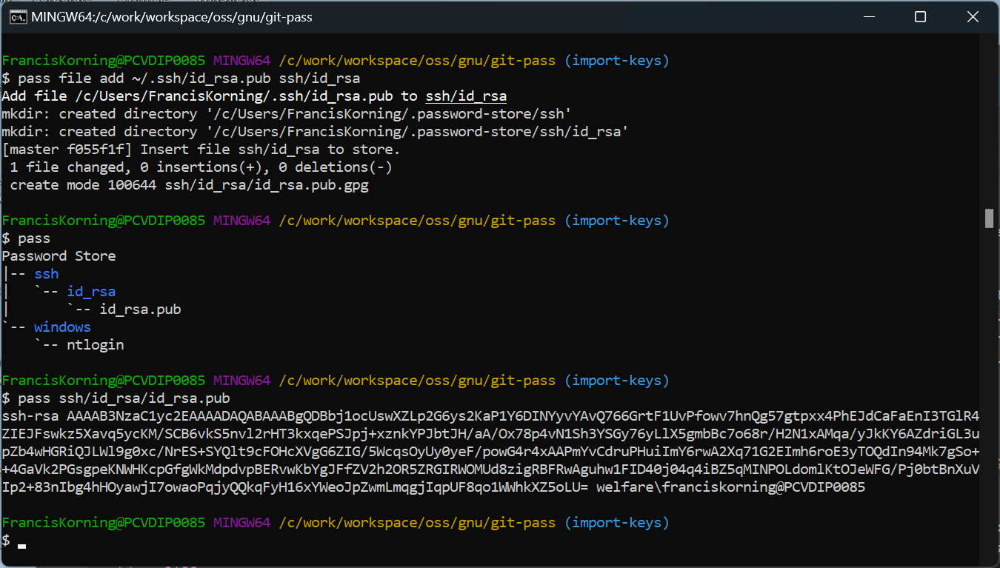

# Git-Pass 

  *Minimal Windows POSIX pass command*

Git-Pass is a port of the POSIX / UNIX pass command (aka password-store)

adapted for corporate and institutional environments that only allow a

minimal Windows POSIX shell on GitBash (or SysGit, MSys, MSys2, MinGW...).

# Motivation

Many corporate and instituional environments restrict allowed software.

often to the frustration of Cloud Operators, Integrators, and Developers.

But cloudops and devops need to secure their machines and drive automation.

.

GitPass is for those cases, where a full Cygwin POSIX is not sanctioned,

Where only gitbash is allowed, where there is no PacMan package manager,

and where we definitely do not have GNU autotools or a GCC GLIBC toolchain.

.

Ideally we want a simple portable POSIX command that works on all platforms.

Pass is designed for portability and simplicity, it is almost 100% bash;

All it requires is a POSIX BASH shell with SSH, SSL, GPG, Git, and Tree.

.

Though password-store is a 100% bash .sh script, it installs via a Makefile.

Now Gnu Make will not present on corporate environment without a toolchain,

and the platform.sh script was broken for gitbash (an easy fix to mingw64).

I've patched it to work on gitbash (it should work on MSys and the others).

.

#  Abstract

The design of pass follows the UNIX / POSIX of composable simple commands.

It attempts to decouple dependencies, and do only one thing, and do it well.

.

This workflow is entirely based on portable, simple POSIX command-line.

Password-Store is a secure Secrets-Vault aka a Secure Password-Manager.

.

It is basically a POSIX directory structure, encrypted via a passphrase.

The encryption uses state of the art RSA 4096 keys and a GnuPG keyring.

.

The directory structure can be a Git repo, it can be shared on machines.

Each .gpg file in a .password-store directory is an ecrypte secret-file.

The 1st line is the secret, subsequent lines are name-value parameters.

.

The organisation therein is up to you (up to organisation's standards).

Typically, you put your SSH PEM keys, passwords, secrets, credentials.

.

You use them from the command-line by unsealing them with the passphrase.

There are a plethora of extension plugins that integrate password-store.

#  Documentation

For the TLDR keep on reading this doc and following instructions.

Browse the official password-store docs For further documentation.

    https://www.passwordstore.org/

#  Preparation

Have an email identity to be used with the following:

    - SSH keypair
    - GPG keyring
    - Git account

Example:

    name:  John Doe
    email: JohnDoe@email.com
   

#  Installation

Clone this git repo and run the install script.

    
    ./install.sh

# Configuration

### Memorable Passphrase

Pick a (Memorable Passphrase)[https://strongphrase.net/]

### GPG KeyRing

Generate your GPG keyring:

    gpg --gen-key

Use following parameters:

    key kind:      1 (RSA)
    key size:      4096
    validity:      0 (never expires)

Sample output:

    Real name: John Doe
    Email address: JohnDoe@email.com
    You selected this USER-ID:
      "John Doe <JohnDoe@email.com>"

### Password-Store

Create a .password-store git repo:

    cd ~
    mkdir -p .password-store
    git init .password-store

Sample Output:

    Initialized empty Git repository in C:/Users/JohnDoe/.password-store/.git/

Initialize the password-store.

    pass init .password-store ${gpg_id}

Sample Output:

    Password store initialized for .password-store, for identity: JohnDoe@Email.com.
    [master (root-commit) e6bcfa6] Set GPG id to .password-store, JohnDoe@Email.com.
     1 file changed, 2 insertions(+)
     create mode 100644 .gpg-id
 

### Unseal (De-Armor) a Secret

The passphrase is needed to dearmor the vault the 1st time we unseal any secret.

Pass will remember the passphrase within a session (Or if we run a GPG-Agent).

.

When using GPG for Windows, this will use the Windows secure PIN entry dialog.

Bear in mind the workflow may vary depending on which version of GPG is installed.

# Operation

### Store a secret (Windows login)

As an example, we store our windows login in the path `windows/ntlogin`.

Note GPG uses the public key to encrypt (and the private key to decrypt).

This means we do not need to provide a passphrase to create a new secret.

_where (***********) is a placeholder for your windows ntlogon password_.

    pass insert windows/ntlogin 

     Enter password for windows/ntlogin:  ***********
     Retype password for windows/ntlogin: ***********
     [master 6ebe58e] Added given password for windows/ntlogin to store.
      1 file changed, 0 insertions(+), 0 deletions(-)
      create mode 100644 windows/ntlogin.gpg

### List secrets

    pass
     Password Store
     `-- windows
         `-- ntlogin

### Use a secret (windows login)

The default usage mode is to print the secret on stdout.

_where (***********) is your windows ntlogon password_.

    pass windows/ntlogin

    ***********

### Limitations

The principle behind pass is that it had to be a simple 100% bash command-line script.

By design pass does one simple thing well: it stores a one-line secret in a text file.

The text file can append name=value parameter pairs, but the first line is the secret.

# Extensions

Now the simple design allows for additional bash extension scripts.

For now, the only extension we require is pass-file (file secrets).

We will add Keepass, Hashicorp vault, and brower plugins later (TODO).

### pass-file

Pass-file allows us to store complete files as secrets (instead of 1-line).

That is, we can use it for multi-line secrets and even for secret binary files:

SSH + X.509 keys, Docker + Kubernetes Secrets, AWS-CLI + Azure-Cli Access-Keys.

    see [Pass-File](https://github.com/dvogt23/pass-file)

    pass file help

# Authentication

With Pass-File we can automate various authentication and authorizations.

## SSH Keypair

If necessary, generate an SSH keypair :

    ssh-keygen -t rsa -b 4096 -C JohnDoe@email.com

Insert the keys

    pass file  add ~/.ssh/id_rsa.pub   ssh/id_rsa/
    pass file  add ~/.ssh/id_rsa       ssh/id_rsa/

List the keys
    pass ssh/id_rsa

    ssh/id_rsa
    |-- id_rsa
    `-- id_rsa.pub

Show the public key

    pass ssh/id_rsa/id_rsa.pub

    ssh-rsa AAAAB3NzaC1yc2EAAAADAQABAAABgQDBbj1ocUswXZLp2G6ys2KaP1Y6DINYyvYAvQ766GrtF1UvPfowv7hnQg57gtpxx4PhEJdCaFaEnI3TGlR4ZIEJFswkz5Xavq5ycKM/SCB6vkS5nvl2rHT3kxqePSJpj+xznkYPJbtJH/aA/Ox78p4vN1Sh3YSGy76yLlX5gmbBc7o68r/H2N1xAMqa/yJkKY6AZdriGL3upZb4wHGRiQJLWl9g0xc/NrES+SYQlt9cFOHcXVgG6ZIG/5WcqsOyUy0yeF/powG4r4xAAPmYvCdruPHuiImY6rwA2Xq71G2EImh6roE3yTOQdIn94Mk7gSo++4GaVk2PGsgpeKNWHKcpGfgWkMdpdvpBERvwKbYgJFfZV2h2OR5ZRGIRWOMUd8zigRBFRwAguhw1FID40j04q4iBZ5qMINPOLdomlKtOJeWFG/Pj0btBnXuVIp2+83nIbg4hHOyawjI7owaoPqjyQQkqFyH16xYWeoJpZwmLmqgjIqpUF8qo1WWhkXZ5oLU= welfare\franciskorning@PCVDIP0085

If you have a GPG Agent, you could delete the private key from ~/.ssh (_Optional_).

This would be maximum security, as there would be no secrets persisted in the clear.

## Agent Forwarding

_TODO_

* Add SSH-Agent
  
* Add GPG-Agent

## Agent Tunneling

### DMZ Bastion

### Azure access

### AWS access

### Docker secrets

### Kubernetes secrets

# TODO

_The next step is to figure out an organisational structure_

_set up agent-forwarding: pick either ssh-agent or gpg-agent_

* evaluate  [win-gpg-agent](https://github.com/rupor-github/win-gpg-agent)

* evaluate  [choco win-gpg-agent](https://community.chocolatey.org/packages/win-gpg-agent)
  

# Integration

_TODO_

_Finally we should develop integration plugins_

* integrate with SOPS Secrets-Operations

* integrate with cloud clients AWS-KMS, Azure AKV, GCP KMS ?

* integrate with HashiCorp Vault, Consul, Nomad, Terraform ?

* integrate with Just-in-Time PIM Privilege Elevation ?

* integrate with PowerShell Secrets Management ?

# Exploration

Now Powershell Secret-Management is pretty good but it's tightly coupled to a Windows Stack.

Hashicorp Vault is just overkill for a lot of situations - ie if we we just want a Dev Box.

The beauty of pass is we can run it anywhere: on windows, on linux, on serverless containers.

.

OK so internally, the simplicity of the .password-store design and structure rocks.

The .password-store dir is just a plain control directory, accessed via conventions.

    $ tree ~/.password-store
    .
    |-- ssh
    |   `-- id_rsa
    |       `-- id_rsa.pub.gpg
    `-- windows
        `-- ntlogin.gpg

    3 directories, 2 files

Each secret is a '.gpg' encrypted with GnuPG.

    $ ls -AlF
    total 5
    drwxr-xr-x 1  FrancisKorning  1049089    0  Sep 22 15:46 .git/
    -rw-r--r-- 1  FrancisKorning  1049089   26  Sep 18 17:16 .gpg-id
    drwxr-xr-x 1  FrancisKorning  1049089    0  Sep 22 19:30 ssh/
    drwxr-xr-x 1  FrancisKorning  1049089    0  Sep 22 11:30   +-- id_rsa/
    -rw-r--r-- 1  FrancisKorning  1049089 1050  Sep 22 19:30     +-- id_rsa.pub.gpg
    drwxr-xr-x 1  FrancisKorning  1049089    0  Sep 22 19:30 windows/
    -rw-r--r-- 1  FrancisKorning  1049089  464  Sep 22 19:30   +-- ntlogin.gpg

All the intelligence is determining the user id and root,

and whether or not we have a custom user extension dir.

So an equivalent powershell script could replicate pass.

Something like:

    GITBASH='C:\ProgramFiles\GitBash\' 
    
    gpg --decrypt %GITBASH%\.password-store\windows\ntlogin.gpg

    ***********

If we map the Gitbash POSIX user home to the Windows user home,

Then we can have everything work together in perfect harmony.

.

For extra marks, we add a plugin to sync it to Hashicorp Vault.

We can even add a plugin to sync Powershell Secret Management.

We would then have a consistent secure workflow across the board.

Finally, for bonus marks, we integrate PIM Just-in-Time privilege.

_TODO_

# Workflow

We need to distinguish between Identity Secrets, and derived Data Secrets,

to distinguish between Initial Trust authentication and derived automations. 

.

On the thin desktop client, we use git-pass to secure the Initial Trust,

to secure Identity Secrets, things like OTP logins, SSH keys, PGP keys.

That's where git-pass comes in.

.

We could try to add extension plugins and make it talk to everything.

We shall try not to reinvent the wheel and use industry-standard tools.

.

We will need to manage scope and temporary Landing Zone access credentials,

to narrow a vendor cloud context to a specific root tenant and org account,

or narrow a cloud managed kubernetes context to a desire kubernetes cluster.

.

The ideal strong security for secrets will use SOPS (Secrets-Operations).

Mozilla SOPS is a neutral Cloud-Native-Foundation tool to secure IaC code,

integrating with GPG, Hashicorp Vault, GCP KMS, AWS KMS, Azure AKV, etc.

But that's on the CI/CD/CT factory and the server, and for Data Secrets.

.

We will address SOPS and cloud context scopes in a later project.

# Automation

_TODO_

    gpg_id=`gpg --list-secret-keys | head -5 | grep uid | xargs | cut -d ' ' -f 5 | tr '<>' '  ' | tee` 2>/dev/null
    gpg_hash=`gpg --list-secret-keys | head -5 | grep 'sec ' | xargs | cut -d ' ' -f 2`

_TODO_

#  Attribution

### Pass on Git

Stephane Korning (stefuss@yahoo.com) for the idea to port POSIX pass to Gitbash.

### Pass

The Pass code is 99.999% verbatim from password-store by Jason Donenfeld.

The patch is basically just packaging of install.sh, and Tree and pass-file.

[Original README](README)

[Original project](https://www.passwordstore.org/)

[Original source](https://git.zx2c4.com/password-store/)

### Tree

In addition, the Tree command is from the Gnuwin32 project (GNU devs).

[Tree command](https://en.wikipedia.org/wiki/Tree_(command))

[Gnuwin32 project](https://en.wikipedia.org/wiki/GnuWin32)

[Gnuwin32 source] (https://sourceforge.net/projects/gnuwin32/)

## Pass-File

The Pass-File extension is 100% bash from (Dima) Dimitrij Vogt (GNU License).

[Pass-File](https://github.com/dvogt23/pass-file)

There is another Pass-File bash extension from Lukas Kropatschek (MIT license).

[Pass-File](https://github.com/lukrop/pass-file/) 

_TODO evaluate which is better ? - sticking to the GNU license one for now !_

# LICENSE

GNU GPL, as per [LICENSE](COPYING)
