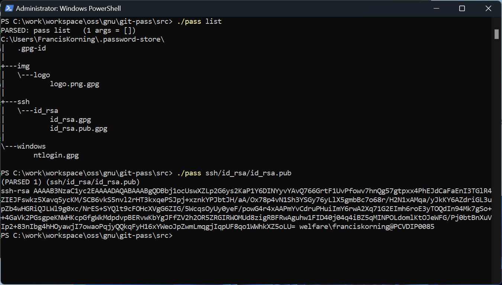
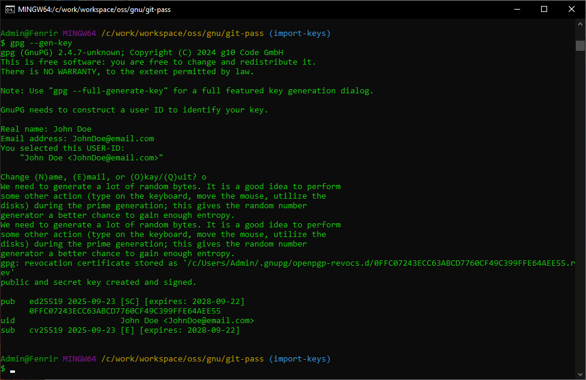

# Git-Pass 

  *Minimal Windows POSIX pass command*

Git-Pass is a port of the POSIX pass command (aka password-store) for GitBash and Powershell.

It is meant for institutional thin-client windows PCs that only allow a minimal GitBash shell.

The beauty of pass is we can run it anywhere: on unix, linux, containers, and now on windows.

.

.

.

# Motivation

Many corporate and institutional environments use minimal thin client PCs

and typically restrict downloads and the gamut of installable software,

often to the frustration of Cloud Operators, Integrators, and Developers.

.

Now cloudops and devops need to secure their machines and drive automation.

For Convenience and for compliance to encrypt data at rest and in transit,

it would be best to install a minimal low-footprint secure secret manager.

.

GitPass is for those cases, where a full Cygwin POSIX is not sanctioned,

Where only gitbash is allowed, where there is no PacMan package manager,

and where we definitely do not have GNU autotools or a GLIBC toolchain.

.

Though password-store is a 100% bash .sh script, it installs via a Makefile.

Gnu Make will not be present on corporate environments without a toolchain,

and the platform.sh script is broken for gitbash (it only expected cygwin).

I've patched it to work on gitbash (it should work on MSys and the others).

.

I've also ported the pass script to powershell and exposed its interface

as a Microsoft windows object (a PowerShell.SecretManagement ISecureVault).

We can use it everywhere: on unix, linux, windows powershell and gitbash !

.

Portability, Simplicity, Security.

#  Abstract

Git-Pass is a port of the POSIX pass command (aka password-store),

for institutional desktops that only allow a limited Gitbash shell.

.

Pass is a secure Secrets Store aka a Secure Password-Manager or Vault.

It follows the POSIX design of using simple composable shell commands.

It is meant for portability and simplicity -it is mostly shell-diven;

all it needs is a shell with installed SSH, SSL, GPG, Git, and Tree.

.

Our architecture design seeks simplicity, portability, and consistency.

Pass gives us a consistent secret manager accross windows, linux, & unix,

even on corporate or institutional minimal thin-client windows desktops.

Git-Pass includes our own `pass.ps1` script porting pass to powershell.

.

There are many secret stores, from Keepass to SOPS and Hashicorp Vault.

Many are UI based and may use licensed binaries or cloud subscriptions.

Many are proprietary and store their database as a single opaque vault.

.

Pass is different. By design it is open and transparent in its workings.

.

Pass is free, lightweight, portable, with well audited open-source code.

It is but a script that calls industry-standard OSS tools: SSL, GPG, Git.

The encryption uses state of the art crypto via RSA keys and GNUPG keys.

.

The vault is just a directory tree, into which go our encrypted secrets.

Thus secret names can be easily located, indexed, globbed, and queried.

This open directory structure makes it extremely adaptable and flexible.

.

The directory can also be a Git repo and can be shared over machines.

It can also be shared with other users or multiple vaults can be used.

.

The secret file format holds a plain text secret on its very first line;

the rest of the file may contain metadata as name-value parameter pairs.

.

You can use it for passwords, secrets, identity credentials, SSH PEM keys.

They can be invoked or piped in a command-line or pasted to the clipboard.

Pass has a plethora of extension plugins to integrate with other systems.

.

The only extension we require is pass-file to encrypt entire files.

We use this to encrypt SSH private keys and Certificate private keys.

Now we could just secure keys with a passphrase - pass simplifies this

by providing a single API interface to unify all our private secrets

in a single vault with a single passphrase.

.

Now because it is but a script that calls other minimal POSIX commands,

we can adapt it and have a common interface for both Bash and Powershell.

For added portability, we can implement the PowerShel.SecretManagement

ISecureVault API and integrate with the windows application ecosystem.

.

# Workflow

We need to distinguish between Identity Secrets and derived Access Secrets,

to isolate the Initial Trust authentication from subsequent authorisations. 

.

On the thin desktop client, we use git-pass to secure the Initial Trust,

to establish Identity Secrets, things like local logins, SSH keys, PGP keys.

That's where git-pass comes in, to establish a secure connection or session.

It is also useful for local desktop apps, for web proxy and web site access.

.

We could try to add extension plugins and make it talk to everything.

We shall try not to reinvent the wheel and use industry-standard tools.

.

We will need to manage scope and temporary Landing Zone access credentials,

to narrow a vendor cloud context to a specific root tenant and org account,

or narrow a cloud managed kubernetes context to a desire kubernetes cluster.

.

The ideal strong security for secrets will use SOPS (Secrets-Operations).

Mozilla SOPS is a neutral Cloud-Native-Foundation tool to secure IaC code,

integrating with GPG, Hashicorp Vault, GCP KMS, AWS KMS, Azure AKV, etc.

But that's on the CI/CD/CT factory and the server, and for Data Secrets.

.

We will address SOPS and cloud context scopes in a later project.

#  Documentation

For the TLDR keep on reading this doc and following instructions.

Browse the official password-store docs For further documentation.

[Original Manual](https://git.zx2c4.com/password-store/about/)

[Original project](https://www.passwordstore.org/)

#  Prerequisite

Have an email identity to be used with the following:

    - Git account
    - SSH keypair
    - GPG keyring

Example:

    name:  John Doe
    email: JohnDoe@email.com
   

#  Installation

In an admin gitbash shell, clone this repo and run the install script.

If you have no yet set up Git, you can use HTTPS or download the zip/tgz.

    ./install.sh

# Configuration

### Git auth fails with non-ASCII Password

This is extremely exotic bug that occured to me in an institutional setup,

with an on-premise TFS and azure devops environment installed via Choco.

Using a non-ascii character (in my case the '£' GBP sterling character)

caused git authentication to fail. Nothing could be done.

.

It turns out using a '£' in your password breaks git.

Why that is is totally mysterious to me.

The only thing I can think of is the Windows Credentials dialog called via misexec

passes the password string as clear text back to GitBash, and this breaks somewhere.

I mean, granted, '£' is not an ASCII char, it's Unicode, but that should not matter!

.

A pass string should accept all characters generated by a an IE or UK keyboard at minimum,

it should be base64 encoded after that, and they should then be decoded in a stream,

so that no special chars are passed-back upstream.

.

*So best to avoid '£' and any non-ascii chars in a windows domain password.*

*Probably best in passphrases as well - Plenty of entropy in ASCII already.*

*And sticking to ASCII will spare you headaches on foreign keyboard settings.*

.

### Memorable Passphrase

Pick a [Memorable Passphrase](https://strongphrase.net/)

### SSH Keypair

If necessary, generate an SSH keypair:

    ssh-keygen -t rsa -b 4096 -C JohnDoe@email.com

### GPG KeyRing

A GPG keyring has primary certifying RSA keypair, a number of UIDs, and a number of sub-keys.

Generate keys interactively with  `--full-generate-key` or programmtically with `--quick-generate-key`.

The interactive option is considered more secure as it captures mouse movements for entropy.

.

If necessary, Generate your GPG keyring.

* ~~Programmatic quick-generate method:~~

    ~~$ gpg --quick-generate-key "JohnDoe@email.com" rsa4096 cert never~~

* Interactive full-generate method:

    $ gpg --full-generate-key

Use following parameters:

    key kind:      1 (RSA)
    key size:      4096
    validity:      0 (never expires)
    name:          John Doe
    email:         JohnDoe@email.com

Sample output:

    Real name: John Doe
    Email address: JohnDoe@email.com
    You selected this USER-ID:
      "John Doe <JohnDoe@email.com>"

# Initialization

Some  of the GPG programmatic commands use the Primary Key id and fingerprint.

Assuming the first key is the default primary key:

    $ gpg --list-secret-keys

    ~.gnupg/pubring.kbx
    ------------------------------------------
    sec   rsa3072 2025-09-18 [SC]
        A7971F081CD28915A2ED831426F423FFE06775FC
    uid           [ultimate] John Doe <JohnDoe@email.com>
    ssb   rsa3072 2025-09-18 [E]

_TODO_

    gpg_fp=`gpg --list-secret-keys | head -4 | tail -1 | awk '{print $1}'`
    gpg_id=`gpg --list-secret-keys | head -5 | tail -1 | awk '{print $NF} | sed -e 's[<>]//g'

_TODO_

### Password-Store Git repo

If necessary, configure your Git user

    git config --global user.name "John Doe"
    git config --global user.name "JohnDoe@email.com"    

Create the `.password-store dir` as a Git repo:

    git init ~/.password-store

    Initialized empty Git repository in C:/Users/JohnDoe/.password-store/.git/

### Password-Store pass database

Initialize the  `.password-store` Pass database.

    pass init .password-store JohnDoe@email.com

    Password store initialized for .password-store, for identity: JohnDoe@Email.com.
    [master (root-commit) e6bcfa6] Set GPG id to .password-store, JohnDoe@Email.com.
     1 file changed, 2 insertions(+)
     create mode 100644 .gpg-id
 

### GPG Passphrase Entry Dialog

.

The GPG passphrase is needed to generate the database and decrypt any secret.

GPG will prompt for a passphrase on first use and and will cache remember it.

.

The mechanism may be 100% command-line, or it may involve a Windows GUI dialog.

The workflow varies: when using an MSys or MinGW GPG this may be command-line.

When using GPG for Windows, this will use the Windows Secure PIN Entry dialog.

# Operation

## Simple Secret 

")

### Store a secret (windows ntlogin)

As an example, we store our windows login in the path `windows/ntlogin`.

Note GPG uses the public key to encrypt (and the private key to decrypt).

This means we do not need to provide a passphrase to create a new secret.

_where (***********) is a placeholder for your windows ntlogon password_.

    pass insert windows/ntlogin 

     Enter password for windows/ntlogin:  ***********
     Retype password for windows/ntlogin: ***********
     [master 6ebe58e] Added given password for windows/ntlogin to store.
      1 file changed, 0 insertions(+), 0 deletions(-)
      create mode 100644 windows/ntlogin.gpg

### List secrets

    pass
     Password Store
     `-- windows
         `-- ntlogin

### Use a secret (windows ntlogin)

The default usage mode is to print the secret on stdout.

_where (***********) is your windows ntlogon password_.

    pass windows/ntlogin

    ***********

## File Secrets (SSH keypair)

With Pass-File (see below) we can automate various authentication and authorizations.

")

### Insert file secrets (SSH keys)

    pass file  add ~/.ssh/id_rsa.pub   ssh/id_rsa/
    pass file  add ~/.ssh/id_rsa       ssh/id_rsa/

### List file secrets

    pass list ssh/id_rsa

    ssh/id_rsa
    |-- id_rsa
    `-- id_rsa.pub

### Use file secret (SSH pub key)

    pass show ssh/id_rsa/id_rsa.pub

    ssh-rsa AAAAB3NzaC1yc2EAAAADAQABAAACAQCez6BEIjpCTXM2O4Gnl5+3le+l9F6jDod9CzG4RjApASAs+BGiVMnUfOlaW3uA/9equaCCOWBWZ9JRZzUQq5KVO0ayrbIkfp6oemsCTxEhsmdGWX5OzMVLzhoxvbS+RVds1eRybLPNENeJ8k3eCPP73mFnKRJixE4/EgUxPMQhZbC4bRxvivmDPH5kHu0EpFZ6DwG9L9lw3YBTMKqxKK78X/qe8BJFMkAOQJ2XndN0AOfl01egmX7BEPcBPjfeVuiv3evs9PT8a6t0MQCeja4RcL1sHhf4crn5Gp0PKJjeXsqAsaV32IXE4xMLBf8mHOLoM9a00kBfXDhl1q+JhQVbA9Iy7meSfJAhl6gbgaxupywrEDdrKQae/vZhCHr6CiNHCRwAAwghNPG8hb6RdrVG52l8MIbN9FRKn/QpIJ3EehPPaqIdWqrNh/WdvmksxYaNF2Cwhtvp/qy8VNV/O0spDYe395rVQEmMvLZwNzExtsPTDFcR0Zr7xjkam23rZHeDf9Rr1YEMDeBv94txpy91ZUxHghYVaDO6un939fOvpsrByvMXkRJSHI3nhj1Dz2kzxYwkuXBJhdULUtTnJHR3gaoAN6sq+BAhpDkUjetD8yDe3kMqb2X4vETeMqsrPpn9vXWBIBDWNbpCDtKe8F4+fBuuaWT2CCxiANDo5vZLSw== JohnDoe@email.com
    

If you have a GPG Agent, you could delete the private key from ~/.ssh (_Optional_).

This would be maximum security, as there would be no secrets persisted in the clear.

# Specification

OK so internally, the simplicity of the .password-store design and structure rocks.

The .password-store dir is just a plain control directory, accessed via conventions.

    $ tree ~/.password-store
    
    .
    |-- ssh
    |   `-- id_rsa
    |       `-- id_rsa.pub    
    |       `-- id_rsa.pub.gpg
    `-- windows
        `-- ntlogin.gpg

    3 directories, 2 files

Each secret is a '.gpg' encrypted with GnuPG.

    $ ls -AlF ~/.password-store/
    
    total 5
    drwxr-xr-x 1  Admin  1049089    0  Sep 22 15:46 .git/
    -rw-r--r-- 1  Admin  1049089   26  Sep 18 17:16 .gpg-id
    drwxr-xr-x 1  Admin  1049089    0  Sep 22 19:30 ssh/
    drwxr-xr-x 1  Admin  1049089    0  Sep 22 11:30   +-- id_rsa/
    -rw-r--r-- 1  Admin  1049089 1050  Sep 22 19:30     +-- id_rsa.pub.gpg
    drwxr-xr-x 1  Admin  1049089    0  Sep 22 19:30 windows/
    -rw-r--r-- 1  Admin  1049089  464  Sep 22 19:30   +-- ntlogin.gpg

All the intelligence is determining the user id and root,

and whether or not we have a custom user extension dir.

So an equivalent powershell script could replicate pass.

# Limitations

Pass provides encryption of Data at Rest: it will safely store all your private keys.

These keys in turn are used to establish secure session and encrypt Data in Transit.

.

Pass by design provides security but not total secrecy: it does not hide secret names.

This transparent directory structure gives maximum portability and shell compatibility.

.

The principle behind pass is that it had to be a simple 100% bash command-line script.

By design pass does one simple thing well: it stores a one-line secret in a text file.

The text file can append name=value parameter pairs, but the first line is the secret.

.

## Fuzzy Default Command

when pass is invoked without a COMMAND, its behaviour varies depending on the path.

If the path maps a secret, it will 'show' it, otherwise it will 'list' the directory.

If no path is specified it will assume we want to list the entire secret vault tree.

# Extensions

Now the simple design allows for additional extensions, usually as plain bash scripts.

Though this doesn't have to be the case, any callable command can do (python, go, ruby).

Extensions will depend on the Workflow (see Workflow above), and our common IAC toolkit.

For now, the only extension we require (which is bundled-in) is pass-file (file secrets).

. 

Additional user extensions can be specified using PASSWORD_STORE_ENABLE_EXTENSIONS.

Custom command extensions can be added as .password-store/.extensions/COMMAND.bash

for a given COMMAND argument.  If the flag is set, and the bash command is executable,

then it is sourced into the environment, passing arguments and environment variables. 

Extensions in a system directory installed by the administrator are always enabled.

## Pass-File

Pass-file allows us to store complete files as secrets (instead of 1-line).

That is, we can use it for multi-line secrets and even for secret binary files:

SSH + X.509 keys, Docker + Kubernetes Secrets, AWS-CLI + Azure-Cli Access-Keys.

    see [Pass-File](https://github.com/dvogt23/pass-file)

    pass file help

## Pass Powershell

Because of its simplicity, it was possible to port pass to the `pass.ps1` Powershell script.

The powershell environment assumes a minimal GitBash POSIX with SSL, SSH, GPG, Git, and Tree.

.

For now it works in its rudiments, we can add, list and show secrets or entire secret files.

We will complete most of the original pass functionality, bar maybe edit and QR encode stuff.

We may add enhacements to both, but that would mean a major fork of trhe original  `pass`.

We are debating whether such enhancements should go in a separate project.

.

For added portability, we can also implement the PowerShel.SecretManagement ISecureVault API

and integrate with the windows application ecosystem.

_TODO_

And we can then also easily with other popular secret managers, like HahshiCorp Vault.

_TODO_

# Enhancements

The beauty of pass is almost all the intelligence is in GPG and the dir structure.

GPG is incredibly rich and powerful, but it is also much too intricate and complex.

Pass leverages it with an opiniated yet flexible dir structure for key management.

_TODO_

## Agent Forwarding

We want to configure a local SSH-Agent or a GPG Agent and have it forward connections.

Forwarding Agents allow a one-time SSO authentication and authorisation via fowarding.

You authenticate once, it caches credentials, and passes them on to chained connections.

This could be used for example to set up Agent-Forwwarding and Tunnellin to a bastion.

_TODO_

* Add SSH-Agent ?
  
* Add GPG-Agent

## Agent Tunneling

Once an Agent is configured, we could writer an extension to open secure proxy tunnels.

* Pass-tunnel Extension

Something like this:

    ~/.password-store/.extensions/tunnel.bash

    pass tunnel <ssh_identity>  <bastion_hostname>:port  <target_hostname>:port

    pass tunnel ssh/id_bastion  bastion.dmz    kubernetes.cluster.local

_TODO_

### DMZ Bastion

### Azure access

### AWS access

### Docker secrets

### Kubernetes secrets

# TODO

_The next step is to figure out an organisational structure_

Organize folders and subkeys:

Something like:

    ~/.secret-store        
        .gpg-id/                        -> primary id: JohnDoe@Email
        dmz/
            id_bastion.gpg
            id_bastion_aws.gpg
            id_bastion_azure.gpg            
        aws/
            .gpg-id/                    -> id: JohnDoe+aws@Email.com
            root/
                aws_root_access_key.gpg
            vpc1/
                aws_vpc1_access_key.gpg
        azure/
            .gpg-id/                    -> id: JohnDoe+azure@Email.com
            root/
                azure_root_access_key.gpg
            vnet1/
                azure_vnet1_access_key.gpg

_set up agent-forwarding: pick either ssh-agent or gpg-agent_

* evaluate  [win-gpg-agent](https://github.com/rupor-github/win-gpg-agent)

* evaluate  [choco win-gpg-agent](https://community.chocolatey.org/packages/win-gpg-agent)
  

_set up agent-tunelling: at minimum tunnel to a bastion host_

Something like:

    pass tunnel --id dmz/id_bastion  bastion.dmz  ubuntu@kubernetes.cluster.local

# Improvements

The following section describes improvements that may go in a different project.

To stick to the original code and the POSIX do-only-one-thing-well philosophy,

I might implement these ideas into a separate project.

## Advanced Workflows

We will add local Keepass, powershell, and browser plugins later (TODO).

We may also consider adding more advanced tools for cloudops and devops IAC,

depending on the workflow.

    SOPS 
    Hashicorp Vault 
    Azure AKV, AWS ASM/KMS, GCP KMS
    Docker, Swarm, Kubernetes, Helm    

## Pass Generation 

Pass already supports random password generation for the individual secrets.

Right now that random password generation uses configurable character classes.

Note NIST now recommends Memorable Passphrases instead of Character Classes.

_TODO_

    - see what can be done here ? - are random chars good enough?
    - note we want to keep pass light and portable
    - we do not want to use dictionaries or hit APIs

## Pass Rotation

Pass-update is a pass extension plugin to batch rotate a set of passwords.

It can be given pattern-based rules for rotation - we want to use a nonce.

We want a rotation based on a non-reproducible HMAC hash of the group ACL.

_TODO_

   investigate

## Shared Secrets

By default pass assumes a single user-vault stored in the user's ~/.password-store.

Pass by design is flexible and makes no imposition on the vault directory structure,

the git repo sharing, or even on the management of GPG identities that can read it.

.

Additional or shared external vaults can be specified using environment variables.

One should use a personal vault per user, with perhaps a shared vault for operators.

This can also be checked-in under Git, Management of the GPG Identity is up to you.

    $GITBASH="C:\Program Files\Git" 
    $PASSWORD_STORE_DIR="$GITBASH\usr\share\.password-store"

    pass init

It probably makes sense to have the users's personal ~/.password-store be stored as

in the private git-repo home for each user, ie have a user personal password-store.

.

As Corporate desktop users are tied to AD Orgs, Groups, and Roles we could assume

such users might also use a default shared secret-store, shared with group members.

Let us standardise this to a second share-secret vault, stored in ~/.secret-store.

    $PASSWORD_STORE_DIR="$env:USERPROFILE\.secret-store"

    pass init

_TODO_

## GPG Sub-UIDs

The above is pretty simplistic and assumes we only have two distinct password vaults.

For added security we may want to split up a vaults to be goverend by different keys.

GPG allows any number of GPG ids to be bound as recipients, which are usually emails.

.

We may also want to use different encryption keys for different folders or secrets.

It turns out both GPG and Pass already support this workflow, via sub uids and keys.

.

Though not in the RFC Email specs, Most Providers allow multiple mailbox aliases

by using the `+` separator. For example, the following all use the same mailbox.

We can use this to define sub uids with which to compartmentalise our key-vaults.

    JohnDoe@email.com
    JohnDoe+dmz@email.com
    JohnDoe+aws@email.com
    JohnDoe+azure@email.com

These can be added as additional GPG UIDS verbatim, or we can do better.

Recall GPG uses the RFC email id spec, where we can specify a long name 

and a comment in the format `Real Name (Comment) <mailbox@email.com>`.

    "John Doe (AWS keys) <JohnDoe+dmz>"

We could add comments like so:

    $ gpg --quick-add-uid JohnDoe@email.com "John Doe (AWS) <JohnDoe+aws@email.com>"

    $ gpg --list-secret-keys

    /c/Users/FrancisKorning/.gnupg/pubring.kbx
    ------------------------------------------
    sec   rsa3072 2025-09-18 [SC] 
        A7971F081CD28915A2ED831426F423FFE06775FC
    uid           [ unknown] John Doe (AWS) <JohnDoe+aws@email.com>
    uid           [ultimate] John Doe <JohnDoe@email.com>
    ssb   rsa3072 2025-09-18 [E] 

Sub UIDs can be removed, which revokes them permanently.

    $ gpg --quick-remove-uid JohnDoe+aws@email.com

_TODO_

figure out how this works.

## GPG Sub-Keys

In addition, GPG allows the derivation of sany number of signed subordinate keys.

One advantage is that sub-keys can be revoked without revoking the owning UID.

Once we can do this we can have all the rudiments a PKI system with group ACLs.

.

Like Primary key, Subkey generation has both an interactive and quick process.

Use `gpg --edit-key` for interactive and `gpg --quick-addkey` for programmatic.

The interactive option is more secure as it captures mouse movements for entropy.

* ~~Programmatic quick-addkey~~

~~    $ gpg --quick-addkey A7971F081CD28915A2ED831426F423FFE06775FC rsa1024 sign 0~~

* Interactive edit-key

_TODO_

    $ gpg --edit-key     JohnDoe@email.com

    to automate: 
    - action = addkey
    - type = 4 RSA sign and/or 6 RSA crypt
    - expiry (never - manually revoked)
    - save

Sub Keys can be revoked

_TODO_

figure out how this works.

### Untrusted Keys

By default GPG uses the key id or fingerprint hash to manipulate keyrings and keys.

Most commands allow to pass-in the email address instead, but be mindful of typos.

.

If ever has to regenerate primary PGP keys, they will be marked `[unknown]`,

This means they are untrusted.  They should be marked with `[ultimate]` trust.

The fix is to manually edit the key.

    gpg --edit-key JohnDoe@email.com

    action: trust
    type:   5 [unconditional]
    save

## Pass ACLs

Now the ultimate in security is revocable shared keys or event transient keys.

What we want is a system where the allowed GPG ids, or subkeys can be revoked.

.

Now as we allow keys and secrets to be shared via Git this is particularly hard.

We have to assume a revoked user already has a stale copy of the vault and keys.

.

The solution here is code our own PKI ACL, with encryption keys being derived 

from the current and latest audience. If the audience changes, the keys change. 

.

In addition we need to invalidate old secrets, since they were shared via Git.

So we need 3 things: (1) a key ratchet mechanism, (2) forced password rotation

on all the secrets previously goverend by that key (for shared text secrets),

and (3) a forced redeployment of all the services consuming those secrets.

.

This would probably reqquire registering said servcies beforehand via an API.

Let's park this for a later day, this is starting to look like a sophisticateed

dynamic secret engine, like Mozilla, SOPS, Hashicorp Vault, or Azure KeyVault.

Also this will not work easily for binary secrets, things like SSH private keys.

.

One thing that could be of use, GPG already accomodate public GPG/PGP Key Servers.

This provides an easy mechnism by which we can revoke keys and issue new ones.

_TODO_

investigate this.  

## Pass-Cert

Note SSH keys and other private keys are often signed X.509 certificates.

As we are using GnuPGP All the low-level SSL/TLS tools are already present.

.

Currently managing self-signed institutional TLS certs is a pain in the neck.

We could leverage the pass store to manage certificate private keys and then

automate a number of the self-signed cert Root CA functions and facilities.

.

It would be nice to automate the generation of CSRs and derived cert chains,

But that may be out of scope for a light, portable, simple, universal vault.

What is sure is that letsencrypt, certbot, and such are not fully portable.

Right now these rely on python, go, and possibly embedded docker webapps.

.

For assume the simplest flow: we can store cert private keys in the vault.

Also store server SSH keys, and use pass to tunnel to a secure Cert server.

That server has the chosen SSL toolkit, and synchs the vault certificates.

Do the manual steps on that server providing the certificate private keys.

_TODO investigate what can be done here_

.

The likely candidate is OpenVPN EasyRSA, a 99% pure POSIX Bash shell tool.

The 1% that is not bash is platform native code, .BAT or PS1 on Windows.

## Pass-JWT

Also in the realm of possibility is for pass to understand JWT Tokens.

It would be awesome to be able to manage ID and Acces tokens in a vault.

This requires some investigation and is straying quite a bit from Pass.

_TODO_

## Pass-SSO

JWT Tokens would open up the possibility of SSO vis OIDC 2.0 / OAuth 2.0.

We could also manage MIT Kerberos tickets and other SSO implementations.

_TODO_

investigate on a rainy winter's night

# Integrations

For extra marks, we add a plugin to sync it to Hashicorp Vault.

We can even add a plugin to sync Powershell Secret Management.

We would then have a consistent secure workflow across the board.

Finally, for bonus marks, we integrate PIM Just-in-Time privilege.

_TODO_

_Finally we should develop integration plugins_

* integrate with PowerShell Secrets Management ?

* integrate with SOPS Secrets-Operations

* integrate with cloud clients AWS-KMS, Azure AKV, GCP KMS ?

* integrate with HashiCorp Vault, Consul, Nomad, Terraform ?

* integrate with Just-in-Time PIM Privilege Elevation ?

#  Attribution

### Pass on Git

Stephane Korning (stefuss@yahoo.com) for the idea to port POSIX pass to Gitbash.

### Pass

The Pass code is 99.999% verbatim from password-store by Jason Donenfeld at ZX2C4.

The patch is basically just packaging of install.sh, and Tree and pass-file.

[Original README](README)

[Original Manual](https://git.zx2c4.com/password-store/about/)

[Original project](https://www.passwordstore.org/)

[Original source](https://git.zx2c4.com/password-store/)

Jason is a senior security consultant and researcher, his work is at ZX2C4.

[ZX2C4](https://www.zx2c4.com/)

[Jason Doenefeld](https://www.jasondonenfeld.com/)

### Tree

In addition, the Tree command is from the Gnuwin32 project (GNU devs).

[Tree command](https://en.wikipedia.org/wiki/Tree_(command))

[Gnuwin32 project](https://en.wikipedia.org/wiki/GnuWin32)

[Gnuwin32 source] (https://sourceforge.net/projects/gnuwin32/)

## Pass-File

The Pass-File extension is 100% bash from (Dima) Dimitrij Vogt (GNU License).

[Pass-File](https://github.com/dvogt23/pass-file)

There is another Pass-File bash extension from Lukas Kropatschek (MIT license).

[Pass-File](https://github.com/lukrop/pass-file/) 

_TODO evaluate which is better ? - sticking to the GNU license one for now !_

# LICENSE

All code, including pass-file and tree, is GNU GPL as per [LICENSE](COPYING).

